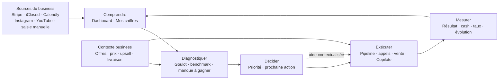

# Minaly — Brief maître UX/UI pour Claude Design

**Version :** 1.0  
**Date :** 7 août 2026  
**Statut :** document de cadrage pour un redesign UX, pas une spécification technique d’implémentation  
**Produit :** Minaly, SaaS d’exécution business pour infopreneurs

---

## 0. Décision importante : pourquoi « Mon business » dans le menu gauche ?

La présence de « Mon business » dans la navigation principale était une décision de découvrabilité : rendre visibles les offres, les prix et l’upsell après leur sortie de la section Vente.

Mais cette décision mélange deux natures de produits :

- **Vente** = l’activité opérationnelle du jour : rendez-vous, appels, prospects, ventes encaissées ;
- **Mon business** = le contexte de l’entreprise : identité, modèle d’acquisition, offres, prix, livraison, ascension et équipe.

Le résultat peut effectivement sembler bizarre : « Mon business » ressemble à une rubrique fourre-tout et devient un pilier au même niveau que le travail quotidien. La recommandation de ce brief est donc :

> **Les produits, prix et upsells restent dans l’espace de contexte business, mais « Mon business » ne doit pas obligatoirement être une entrée principale de la sidebar.**

### Placement recommandé

Navigation principale :

1. Dashboard / À faire maintenant
2. Mes chiffres
3. Acquisition
4. Vente
5. Diagnostic
6. Copilote

Navigation secondaire :

- Business & offres — accessible depuis l’avatar, les réglages, l’onboarding et les nudges de complétion ;
- Intégrations ;
- Réglages ;
- Équipe ;
- Parrainage.

Si une entrée de sidebar est conservée, préférer **« Business & offres »** ou **« Configuration business »** à « Mon business », et la séparer visuellement des espaces opérationnels.

La décision finale doit être prise après comparaison de deux variantes dans le prototype :

- **Variante A — recommandée :** Business & offres dans l’espace compte / configuration ;
- **Variante B :** Business & offres dans la sidebar, mais en entrée secondaire, après un séparateur et sans être présenté comme un levier d’action quotidien.

---

## 1. Vision produit en une phrase

> **Minaly détecte le goulot qui coûte du cash à un infopreneur, lui dit quoi faire maintenant, l’aide à l’exécuter et mesure si la situation s’améliore.**

Minaly ne doit pas être perçu comme :

- un dashboard de plus ;
- un CRM généraliste ;
- un outil de reporting sans action ;
- un chatbot qui donne des conseils génériques.

Minaly doit être perçu comme une **couche d’exécution pilotée par le diagnostic** :



### Promesse utilisateur

À chaque ouverture, l’utilisateur doit pouvoir répondre en moins de dix secondes à trois questions :

1. **Où est-ce que je perds de l’argent ?**
2. **Qu’est-ce qui est prioritaire aujourd’hui ?**
3. **Quelle action dois-je faire maintenant ?**

---

## 2. Utilisateurs et jobs-to-be-done

### Persona 1 — Fondateur / infopreneur

Business de services, coaching, formation ou accompagnement, typiquement entre 10k et 100k $/mois.

Il veut savoir où agir sans passer sa journée à réconcilier Stripe, les appels, les contenus et les feuilles de calcul.

Job principal :

> « Aide-moi à récupérer plus de cash sans me donner un nouveau tableau à surveiller. »

### Persona 2 — Opérateur / bras droit / responsable croissance

Il transforme le diagnostic en actions concrètes : suivi des leads, relances, performance des canaux, reporting hebdomadaire.

Job principal :

> « Donne-moi une file de travail claire, avec le contexte et la valeur de chaque action. »

### Persona 3 — Setter

Il gère les premiers échanges, les conversations et la prise de rendez-vous.

Job principal :

> « Montre-moi quels leads traiter, où ils en sont et comment améliorer mon passage vers le rendez-vous. »

### Persona 4 — Closer

Il gère les appels, les no-shows, les décisions en attente et les ventes conclues.

Job principal :

> « Aide-moi à mieux convertir les appels et à ne laisser aucune décision ou relance se perdre. »

### Persona 5 — Finance / administration

Il vérifie le cash encaissé, les impayés, les remboursements, les échéanciers et les rapprochements Stripe.

Job principal :

> « Donne-moi une lecture fiable de ce qui a réellement été encaissé, reste dû ou remboursé. »

### Persona 6 — Administrateur Minaly

Utilisateur interne, hors parcours client : comptes, plans, abonnements, referrals et supervision.

Job principal :

> « Gérer la plateforme sans polluer l’expérience business du client. »

---

## 3. Principes UX non négociables

### 3.1 Une destination = une question principale

- **Dashboard :** que dois-je faire maintenant ?
- **Mes chiffres :** quelles sont mes données et leur évolution ?
- **Acquisition :** comment les prospects arrivent-ils ?
- **Vente :** que se passe-t-il entre le prospect, l’appel et l’encaissement ?
- **Diagnostic :** quel est le goulot et quel est son impact ?
- **Copilote :** comment réfléchir et exécuter avec de l’aide ?
- **Business & offres :** quel est mon modèle et comment est-il configuré ?
- **Intégrations :** quelles sources sont connectées et à jour ?
- **Réglages :** qui peut accéder à quoi et comment fonctionne mon compte ?

### 3.2 Pas de doublons de lecture

Une métrique peut être réutilisée dans un contexte, mais elle ne doit pas avoir trois cartes concurrentes qui racontent la même chose.

- Dashboard = synthèse décisionnelle ;
- Mes chiffres = données détaillées et historique ;
- Diagnostic = comparaison au benchmark et explication ;
- Acquisition / Vente = détail opérationnel ;
- Business & offres = configuration, avec seulement une performance contextuelle légère ;
- Copilote = conversation et exécution, pas une nouvelle page de reporting.

### 3.3 L’IA accompagne l’action, elle ne remplace pas la hiérarchie

Falco et le Copilote servent à :

- formuler le diagnostic ;
- expliquer une priorité ;
- proposer un plan ;
- contextualiser une action ;
- aider à produire un message, un script ou une amélioration.

Ils ne doivent pas :

- répéter toute la page ;
- monopoliser chaque écran ;
- présenter une estimation comme un fait ;
- remplacer une action métier claire par une bulle conversationnelle.

### 3.4 La valeur avant la configuration

L’utilisateur doit atteindre un premier insight avant de devoir remplir tous les champs secondaires. La complétion du business augmente la précision, mais ne doit pas devenir un mur d’onboarding.

### 3.5 Chaque chiffre doit être compréhensible

Pour une estimation de gain :

- afficher la période ;
- afficher la source ;
- expliquer la formule ou proposer « comment c’est calculé » ;
- différencier chiffre observé, benchmark et projection ;
- signaler les données manquantes.

---

## 4. Carte de l’application actuelle

Cette carte décrit le produit existant à prendre en compte dans le redesign. Elle ne signifie pas que chaque destination doit rester au même niveau dans la navigation.

| Espace | Route actuelle | Question utilisateur | Fonctionnalités existantes |
|---|---|---|---|
| Dashboard | `/dashboard` | Que dois-je faire maintenant ? | Greeting, manque à gagner, KPI du mois, comparaison au mois précédent, actions commerciales, alertes techniques, check-in hebdo, rapport hebdo |
| Mes chiffres | `/datas` | Quelles sont mes données ? | Saisie mensuelle, historique, import, tendance CA/leads/RDV/ventes, navigation par mois |
| Acquisition | `/acquisition` | Comment générer et qualifier plus de demandes ? | Contenu, Mail, Pipeline, Setters, Ads |
| Contenu | `/acquisition/contenu` | Quels contenus performent ? | Instagram, YouTube, vues, rétention, engagement, recommandations, filtres de période et de plateforme |
| Mail | `/acquisition/mail` | L’email convertit-il ? | Campagnes, ouvertures, clics, CA attribué, RDV, ventes |
| Pipeline | `/acquisition/pipeline` | Qui faire avancer ? | Kanban, funnel, leads, valeur potentielle, source, offre, setter, closer, notes, rappels, raisons de perte, validation de vente |
| Setters | `/acquisition/setters` | Quelle est la performance du setting ? | Membres, performance, détail par setter, accès par rôle |
| Ads | `/acquisition/ads` | La publicité est-elle rentable ? | Campagnes, budget, dépense, impressions, clics, leads, déclenchement d’une amélioration de copy |
| Vente | `/ventes` | Que se passe-t-il après l’acquisition ? | Landing vers les sous-espaces opérationnels |
| Suivi des ventes | `/ventes/suivi` | Qu’est-ce qui a été vendu et encaissé ? | Ventes manuelles, import / réconciliation Stripe, paiements réussis, impayés, remboursements, orphelins, échéanciers, drawer de détail, filtres |
| Suivi des appels | `/ventes/appels` | Que se passe-t-il pendant les appels ? | iClosed, appels manuels, présents, no-shows, annulations, issue d’appel, montant closé, funnel, vidéos et analyse d’appel |
| Rendez-vous | `/ventes/rdv` | Quels rendez-vous arrivent ? | Agenda unifié, Calendly, iClosed, réservation native, questions de qualification, lien public, annulation, leads abandonnés |
| Business & offres | `/business` | Quel est mon modèle business ? | Identité, niche, acquisition, offres, prix, mode de vente, récurrence, process de closing, relances, livraison, onboarding, support, témoignages, upsell / ascension, équipe |
| Diagnostic | `/diagnostic` | Quel est mon goulot ? | Score, périodes, points à améliorer, points forts, leviers à ajouter, benchmarks, manque à gagner, projection, découverte |
| Démarrer un levier | `/demarrer/[leverKey]` | Comment mettre ce levier en place ? | Plan de démarrage, étapes, ressources et vidéos sélectionnées |
| Copilote | `/copilote` | Comment passer à l’exécution ? | Conversation Falco, contexte de page, amélioration, analyse d’appel, copy ads, actions guidées |
| Journal de bord | `/journal` | Qu’ai-je fait et que dois-je suivre ? | Jours, projets, tâches, jalons, notes |
| Intégrations | `/integrations` | Mes sources sont-elles connectées ? | Stripe, iClosed, Calendly, Instagram, YouTube, synchronisation et erreurs |
| Réglages | `/settings` | Comment fonctionne mon compte ? | Profil, clé Anthropic BYOK, facturation, équipe, permissions, zone de danger, préférences Falco |
| Parrainage | `/parrainage` | Comment recommander Minaly ? | Lien, comptes parrainés, commissions, historique |
| Admin interne | `/admin` | Comment opérer Minaly ? | Plans, abonnements, comptes, supervision, referrals |

### Sources de données à préserver

- Stripe Connect du client : paiements et source principale du diagnostic ;
- iClosed : appels de closing ;
- Calendly : prises de rendez-vous ;
- Instagram : analytics de contenu ;
- YouTube : analytics de chaîne et vidéos ;
- saisie manuelle mensuelle et imports ;
- clé Anthropic BYOK du client pour l’agent, chiffrée et jamais affichée en clair.

Ne pas ajouter Kajabi, Brevo ou une nouvelle intégration sans décision produit explicite.

---

## 5. Architecture de navigation proposée

### Navigation primaire cible

```text
Dashboard
Mes chiffres
Acquisition
  ├── Contenu
  ├── Mail
  ├── Pipeline
  ├── Setters
  └── Ads
Vente
  ├── Suivi des ventes
  ├── Suivi des appels
  └── Rendez-vous
Diagnostic
Copilote
```

### Navigation secondaire cible

```text
Business & offres
  ├── Identité & modèle
  ├── Offres & prix
  ├── Livraison client
  ├── Upsell & ascension
  └── Équipe
Intégrations
Réglages
Parrainage
Journal de bord
```

### Règles de navigation

- Ne pas afficher les mêmes sous-pages dans la sidebar, dans un flyout au survol et dans une seconde barre permanente ; une seule surface de navigation suffit.
- Le clic sur un pilier mène à sa vue d’ensemble ; les onglets secondaires sont visibles dans le contexte du pilier.
- Le hover ne doit jamais être nécessaire pour découvrir une page.
- Sur mobile, transformer les sous-pages en sélecteur ou en onglets scrollables accessibles, pas en mini-sidebar horizontale illisible.
- Rendez-vous peut rester un raccourci quotidien, mais il ne doit pas devenir une deuxième destination indépendante en plus de `Vente > Rendez-vous`.
- Les anciennes URLs `/ventes/produits` et `/ventes/upsell` restent compatibles pour les favoris, mais ne doivent plus apparaître dans la navigation.

### Règle spécifique aux offres et à l’upsell

Les objets suivants appartiennent au même modèle mental :

```text
Offre principale
Offres secondaires
Prix et modalités de paiement
Process de vente
Livraison
Upsell / ascension
```

Ils doivent donc être configurés dans **Business & offres**. La performance peut être rappelée dans `Vente > Suivi des ventes`, mais la configuration ne doit pas être dupliquée.

---

## 6. Inventaire fonctionnel à conserver et à rendre lisible

### 6.1 Dashboard — « À faire maintenant »

Le Dashboard est le point d’entrée de la boucle de valeur, pas un catalogue de cartes.

Contenu recommandé, dans cet ordre :

1. **Verdict court** : état du business et manque à gagner détecté ;
2. **Une action prioritaire** : ce qui peut débloquer le plus de cash ;
3. **Deux à quatre actions secondaires** : relance, no-show, lead stagnant, donnée à compléter ;
4. **KPI de contexte** : CA encaissé, nouveaux clients, leads, RDV, closing, panier moyen ;
5. **Alertes techniques** : clé invalide, intégration en erreur, synchronisation incomplète ;
6. **Check-in hebdomadaire** et rapport précédent.

Chaque action doit afficher :

- la raison de la priorité ;
- le levier concerné ;
- la valeur ou le manque à gagner ;
- l’ancienneté ou l’échéance ;
- la source de donnée ;
- une action principale : ouvrir, terminer ou reporter.

### 6.2 Mes chiffres — la source de vérité des données

Cette zone doit privilégier la compréhension des données brutes et de leur évolution :

- période sélectionnée ;
- CA encaissé et CA contracté, clairement différenciés ;
- leads, conversations, appels proposés, appels réservés ;
- appels pris, no-shows, ventes conclues ;
- taux de conversion, closing, show-up et panier moyen ;
- évolution mois par mois ;
- origine de chaque donnée : Stripe, iClosed, Calendly, import ou saisie.

Ne pas y répéter toute l’analyse de benchmark du Diagnostic.

### 6.3 Acquisition

#### Contenu

L’utilisateur veut savoir :

- quel contenu attire une audience ;
- quel contenu génère des leads ou des RDV ;
- quelles vidéos retiennent l’attention ;
- quel canal mérite une prochaine action.

Fonctions :

- vues Instagram et YouTube ;
- engagement, rétention et comparaison de formats ;
- filtres par plateforme et période ;
- identification des contenus forts et faibles ;
- recommandations actionnables ;
- passage au Copilote avec le contenu et la métrique en contexte.

#### Mail

L’utilisateur veut relier l’email à l’activité commerciale.

Fonctions :

- campagnes ;
- ouvertures et clics ;
- CA attribué ;
- RDV bookés ;
- ventes conclues ;
- lecture de la performance par période.

#### Pipeline

Le Pipeline ne doit pas devenir un CRM généraliste. Il doit rester une couche d’exécution.

Fonctions :

- vue « À faire aujourd’hui » ;
- Kanban par étape ;
- funnel ;
- création et édition de lead ;
- valeur potentielle ;
- source et offre ;
- setter et closer ;
- notes, rappels et historique ;
- raison de perte ;
- validation d’une vente ;
- association à un appel et à une vente ;
- prochaine action explicite.

La fiche lead doit réunir :

```text
Nom · étape · priorité · valeur potentielle
Prochaine action · raison de priorité · échéance
Timeline : lead → conversation → rendez-vous → appel → vente
Notes · rappels · historique
Copilote contextualisé
```

#### Setters

- performance par setter ;
- volume de conversations ;
- appels proposés et réservés ;
- taux de passage ;
- accès limité aux permissions assignées ;
- lien vers les leads concernés.

#### Ads

- campagnes et période ;
- budget prévu ;
- dépense ;
- impressions ;
- clics ;
- leads ;
- lecture coût / résultat ;
- déclenchement du Copilote pour améliorer le message publicitaire.

### 6.4 Vente

#### Suivi des ventes

Une vente représente un deal ; les prélèvements sont une vue de paiement, pas des ventes supplémentaires.

Fonctions :

- ajout manuel d’une vente ;
- source Stripe ou manuelle ;
- vente one-shot, échéancier ou abonnement ;
- total du deal ;
- paiements reçus ;
- reste à payer ;
- échéance impayée ;
- remboursement ;
- vente Stripe orpheline ;
- rattachement manuel d’un paiement ;
- filtres par statut, période, offre et source ;
- métriques calculées au niveau du deal pour éviter de gonfler le CA avec un paiement en plusieurs fois.

L’écran doit répondre à :

> « Combien ai-je vendu, combien ai-je encaissé, combien est à risque et que dois-je traiter ? »

#### Suivi des appels

- synchronisation iClosed ;
- saisie manuelle ;
- appels honorés ;
- no-shows ;
- appels réservés ;
- appels annulés ;
- issue de l’appel ;
- montant closé ;
- funnel de closing ;
- détail de l’appel ;
- vidéos et ressources d’analyse ;
- commentaire et action de suivi ;
- passage au Copilote pour analyser le closing.

#### Rendez-vous

- agenda unifié ;
- Calendly, iClosed et réservation native ;
- événements et disponibilités ;
- questions de qualification ;
- page publique de réservation ;
- lien copiable ;
- modification ou annulation ;
- leads abandonnés ;
- prochaines réservations ;
- accès adapté aux permissions.

### 6.5 Business & offres — espace de contexte, pas de production quotidienne

#### Identité et modèle

- nom du business ;
- niche / secteur ;
- avatar / identité visuelle ;
- indicateurs de contexte ;
- mode d’acquisition ;
- modèle de vente.

#### Offres & prix

- offre principale ;
- offres secondaires ;
- nom et prix ;
- type de vente ;
- one-shot, échéancier ou abonnement ;
- commission setter ;
- process de closing ;
- suivi des non-acheteurs ;
- fréquence et structure des relances ;
- lien avec le diagnostic et le calcul du panier moyen.

#### Livraison client

- onboarding ;
- format de support : communauté, calls de groupe, 1-to-1 ou aucun ;
- fréquence de support ;
- preuve sociale ;
- collecte de témoignages ;
- communauté ;
- réactivation d’anciens clients.

#### Upsell & ascension

- offre d’ascension ;
- conditions ou moment de proposition ;
- offre concernée ;
- prix ;
- take-rate observé ;
- CA généré ;
- panier moyen avec et sans upsell ;
- comparaison au benchmark ;
- lien vers une prochaine action.

Le bloc de performance dans Business & offres doit rester secondaire : il aide à confirmer la configuration, mais ne doit pas reproduire l’écran complet de suivi des ventes.

#### Équipe

- invitation ;
- rôle ;
- permissions ;
- accès par espace ;
- distinction propriétaire / membre ;
- explication claire des restrictions.

### 6.6 Diagnostic

Le Diagnostic est le moteur de priorisation.

Il doit séparer explicitement :

1. **Optimiser ce qui existe déjà** : taux réel sous le benchmark ;
2. **Ajouter ce qui manque** : levier non encore mis en place ;
3. **Comprendre les points forts** : ce qui fonctionne ;
4. **Voir la projection** : ce qui se passe si les principaux écarts se réduisent.

Le diagnostic doit montrer :

- période analysée ;
- taux réel ;
- benchmark ;
- statut ;
- clients supplémentaires potentiels ;
- gain estimé ;
- effort ;
- méthode de calcul ;
- CTA « Voir le détail », « Commencer » ou « Améliorer ».

Le catalogue de leviers actuel couvre notamment :

- **Acquisition :** lead magnet, email marketing, newsletter, blog / SEO, podcast, retargeting, parrainage, publicité ;
- **Vente :** VSL, webinaire / masterclass, relance des non-acheteurs, order bump, downsell, garantie, preuve sociale ;
- **Délivrabilité :** upsell / ascension, onboarding, collecte de témoignages, communauté clients, réactivation d’anciens clients.

Le Diagnostic ne doit pas transformer tous les leviers en tâches simultanées. Il doit imposer une hiérarchie.

### 6.7 Copilote

Le Copilote est le lieu de conversation et d’aide à l’exécution.

Il doit pouvoir recevoir :

- la page courante ;
- le levier sélectionné ;
- la métrique et sa période ;
- l’offre concernée ;
- le prospect ou l’appel concerné ;
- la recommandation déjà affichée.

Cas d’usage :

- améliorer un levier ;
- écrire une publicité ;
- analyser un appel ;
- formuler une relance ;
- convertir un diagnostic en plan ;
- clarifier une donnée ;
- expliquer le calcul d’un manque à gagner.

Le Copilote doit toujours distinguer :

- information observée ;
- hypothèse ;
- suggestion ;
- action que l’utilisateur doit valider.

### 6.8 Intégrations, données et réglages

Les intégrations doivent afficher un état très lisible :

```text
Connecté · Synchronisation en cours · Synchronisé le …
Erreur · Autorisation expirée · Données insuffisantes
```

Chaque erreur doit expliquer :

- ce qui ne fonctionne plus ;
- l’impact sur les métriques ;
- l’action de récupération ;
- la date de la dernière donnée fiable.

Les réglages doivent isoler clairement :

- profil ;
- clé Anthropic BYOK ;
- facturation Minaly ;
- équipe et permissions ;
- préférences Falco ;
- suppression du compte.

---

## 7. User stories complètes

Format : **En tant que [rôle], je veux [action], afin de [valeur].**

### Epic A — Activation et premier résultat

- **A1.** En tant que fondateur, je veux comprendre en une phrase ce que Minaly corrige, afin de savoir pourquoi connecter mes données.
- **A2.** En tant que fondateur, je veux connecter Stripe avec un accès explicite, afin d’obtenir une vision réelle de mon cash sans ambiguïté.
- **A3.** En tant que fondateur, je veux voir l’état de chaque intégration, afin de savoir si mon diagnostic repose sur des données fraîches.
- **A4.** En tant que fondateur, je veux renseigner les informations essentielles de mon business sans remplir un questionnaire interminable, afin d’obtenir rapidement un premier diagnostic.
- **A5.** En tant que fondateur, je veux savoir quelles informations manquent et pourquoi elles amélioreraient le diagnostic, afin de choisir quoi compléter.
- **A6.** En tant que fondateur, je veux voir mon premier goulot avec une explication chiffrée, afin de comprendre immédiatement la valeur de Minaly.
- **A7.** En tant que fondateur, je veux lancer une première action depuis le diagnostic, afin de ne pas rester dans l’analyse.
- **A8.** En tant que propriétaire, je veux enregistrer ma clé BYOK de façon sécurisée, afin d’utiliser l’agent avec ma propre clé.
- **A9.** En tant que propriétaire, je veux inviter mon équipe après le premier résultat, afin de ne pas être bloqué par la gestion des rôles au démarrage.

### Epic B — Orientation quotidienne et hebdomadaire

- **B1.** En tant que fondateur, je veux ouvrir le Dashboard et savoir quelle action a le plus de valeur aujourd’hui, afin de ne pas choisir au hasard.
- **B2.** En tant qu’opérateur, je veux voir les actions en retard, afin de traiter les fuites déjà identifiées.
- **B3.** En tant que setter, je veux voir les leads qui nécessitent une action, afin d’éviter les conversations oubliées.
- **B4.** En tant que closer, je veux voir les décisions en attente et les no-shows à récupérer, afin de récupérer du CA déjà proche de la vente.
- **B5.** En tant que fondateur, je veux comprendre la raison de chaque priorité, afin de faire confiance au classement.
- **B6.** En tant qu’utilisateur, je veux terminer ou reporter une action avec une date, afin que la file de travail reste fiable.
- **B7.** En tant que fondateur, je veux mettre à jour mes chiffres en quelques minutes chaque semaine, afin de maintenir un diagnostic utile.
- **B8.** En tant que fondateur, je veux consulter mon rapport hebdomadaire, afin de voir ce qui a changé et ce qui mérite mon attention.
- **B9.** En tant qu’utilisateur, je veux distinguer une alerte business d’une alerte technique, afin de ne pas confondre problème de performance et problème de synchronisation.

### Epic C — Données et compréhension

- **C1.** En tant que finance, je veux distinguer CA encaissé et CA contracté, afin d’éviter une lecture trompeuse de ma trésorerie.
- **C2.** En tant que finance, je veux voir les paiements réussis, impayés, remboursés et orphelins, afin de savoir ce qui doit être traité.
- **C3.** En tant que fondateur, je veux comparer plusieurs périodes, afin de voir une tendance et pas seulement un instantané.
- **C4.** En tant que fondateur, je veux savoir la source de chaque métrique, afin de comprendre ce qui est importé, calculé ou saisi.
- **C5.** En tant qu’utilisateur, je veux importer ou saisir mes chiffres quand une intégration n’existe pas, afin que le produit reste utile même partiellement connecté.
- **C6.** En tant qu’utilisateur, je veux voir la date de fraîcheur d’une donnée, afin de savoir si je peux prendre une décision dessus.

### Epic D — Diagnostic et priorisation

- **D1.** En tant que fondateur, je veux voir mon score et mes principaux goulots, afin de comprendre la santé globale du business.
- **D2.** En tant que fondateur, je veux savoir ce qui est déjà en place mais sous le benchmark, afin d’optimiser avant d’ajouter de la complexité.
- **D3.** En tant que fondateur, je veux voir les leviers que je n’exploite pas encore, afin d’identifier les opportunités pertinentes.
- **D4.** En tant que fondateur, je veux voir le gain estimé et le niveau d’effort, afin de choisir une action réaliste.
- **D5.** En tant que fondateur, je veux comprendre le calcul du gain, afin de distinguer une estimation prudente d’un chiffre observé.
- **D6.** En tant que fondateur, je veux connaître le levier numéro un, afin de ne pas disperser mon attention.
- **D7.** En tant que fondateur, je veux ouvrir un plan de démarrage pour un levier, afin de passer d’une idée à une suite d’étapes.
- **D8.** En tant qu’utilisateur, je veux masquer ou reconsulter les leviers déjà traités, afin que le diagnostic reste lisible dans le temps.
- **D9.** En tant que fondateur, je veux répondre à des questions de découverte quand le produit manque de contexte, afin d’obtenir des recommandations plus pertinentes.

### Epic E — Acquisition

- **E1.** En tant que créateur, je veux comparer mes contenus Instagram et YouTube, afin d’identifier les formats qui attirent vraiment l’attention.
- **E2.** En tant que créateur, je veux voir la rétention et l’engagement, afin de comprendre pourquoi un contenu fonctionne ou non.
- **E3.** En tant que marketeur, je veux suivre mes campagnes email, afin de relier ouvertures, clics, RDV et CA.
- **E4.** En tant que setter, je veux gérer mes leads par étape, afin de savoir qui contacter ensuite.
- **E5.** En tant que setter, je veux voir la source, la valeur potentielle et la prochaine action d’un lead, afin de prioriser mes conversations.
- **E6.** En tant que setter, je veux enregistrer la raison d’une perte, afin d’améliorer le diagnostic du funnel.
- **E7.** En tant que responsable acquisition, je veux suivre budget, dépenses, clics et leads par campagne, afin de ne pas augmenter un budget à l’aveugle.
- **E8.** En tant que marketeur, je veux demander au Copilote d’améliorer une copy avec son contexte, afin d’obtenir une proposition directement liée à mes données.

### Epic F — Vente, appels et rendez-vous

- **F1.** En tant que setter, je veux créer ou modifier un rendez-vous, afin de garder mon agenda à jour.
- **F2.** En tant que fondateur, je veux réunir Calendly, iClosed et la réservation native dans un agenda lisible, afin d’éviter de vérifier plusieurs outils.
- **F3.** En tant que closer, je veux voir les appels honorés, no-shows, annulés et à venir, afin de gérer mon temps et mes relances.
- **F4.** En tant que closer, je veux enregistrer le résultat d’un appel et le montant closé, afin d’alimenter mon funnel.
- **F5.** En tant que closer, je veux revoir les détails ou la vidéo d’un appel, afin d’identifier ce qui bloque la conversion.
- **F6.** En tant que finance, je veux ajouter une vente manuelle quand elle n’est pas encore synchronisée, afin de ne pas perdre une transaction.
- **F7.** En tant que finance, je veux rapprocher un paiement Stripe d’un deal existant, afin d’éviter les doublons et les ventes orphelines.
- **F8.** En tant que finance, je veux créer ou traiter une vente orpheline, afin que chaque paiement ait un statut compréhensible.
- **F9.** En tant que finance, je veux voir le reste à payer et les échéances, afin de prioriser les impayés.
- **F10.** En tant que fondateur, je veux que les paiements en plusieurs fois ne gonflent pas artificiellement mon CA, afin de piloter sur des chiffres fiables.
- **F11.** En tant que fondateur, je veux relier une vente à une offre, afin de comprendre quels produits génèrent le revenu.

### Epic G — Business, offres et ascension

- **G1.** En tant que fondateur, je veux définir mon offre principale, afin que le diagnostic utilise le bon prix de référence.
- **G2.** En tant que fondateur, je veux définir mes offres secondaires, afin de représenter mon vrai catalogue.
- **G3.** En tant que fondateur, je veux préciser si une offre est one-shot, en échéancier ou en abonnement, afin de lire correctement le cash et la valeur contractée.
- **G4.** En tant que fondateur, je veux définir mon process de closing et mes relances, afin que le diagnostic sache ce qui existe réellement.
- **G5.** En tant que fondateur, je veux définir une offre d’upsell dans le même espace que mes produits, afin de ne pas la chercher dans Vente.
- **G6.** En tant que fondateur, je veux voir le take-rate et le CA de l’upsell, afin de mesurer l’ascension de mes clients.
- **G7.** En tant que fondateur, je veux configurer l’onboarding et la livraison, afin d’améliorer l’expérience après l’achat.
- **G8.** En tant que fondateur, je veux renseigner témoignages, communauté et réactivation, afin d’exploiter les leviers de délivrabilité.
- **G9.** En tant que propriétaire, je veux gérer l’équipe et les rôles sans quitter le contexte du business, afin de déléguer sans perdre le contrôle.
- **G10.** En tant qu’utilisateur, je veux comprendre pourquoi compléter mon business améliore le diagnostic, afin de ne pas remplir des champs sans valeur visible.

### Epic H — Copilote et exécution

- **H1.** En tant que fondateur, je veux demander comment corriger mon goulot, afin d’obtenir un plan adapté à ma situation.
- **H2.** En tant que closer, je veux analyser un appel avec son contexte, afin d’améliorer mon script et mes objections.
- **H3.** En tant que marketeur, je veux générer ou améliorer une publicité avec mes données, afin d’augmenter mes chances de résultat.
- **H4.** En tant qu’utilisateur, je veux voir quelles données ont été utilisées par l’agent, afin de comprendre sa recommandation.
- **H5.** En tant qu’utilisateur, je veux valider une suggestion avant qu’elle ne devienne une action, afin de garder le contrôle.
- **H6.** En tant que propriétaire, je veux voir ma consommation de tokens sans exposer ma clé, afin de piloter mon usage BYOK ou le quota partagé.

### Epic I — Compte, confiance et monétisation

- **I1.** En tant que propriétaire, je veux voir mon plan et son état, afin de comprendre ce qui est inclus.
- **I2.** En tant que propriétaire, je veux changer de plan avec une différence de valeur explicite, afin de prendre une décision éclairée.
- **I3.** En tant que propriétaire, je veux voir les limites d’équipe, de Copilote, d’intégrations et de réservation, afin d’éviter les surprises.
- **I4.** En tant que propriétaire, je veux gérer mon abonnement et la facturation, afin de garder la main sur mon compte Minaly.
- **I5.** En tant qu’utilisateur, je veux recevoir une invitation et voir uniquement les pages auxquelles j’ai accès, afin que l’interface soit adaptée à mon rôle.
- **I6.** En tant que fondateur, je veux parrainer un autre business, afin de bénéficier d’un programme de recommandation compréhensible.
- **I7.** En tant que fondateur, je veux supprimer mon compte avec une explication des conséquences, afin de garder le contrôle de mes données.

---

## 8. Parcours critiques à prototyper

### Parcours 1 — De zéro à la première action

```text
Inscription
  → Choix du contexte business
  → Connexion Stripe
  → 3 à 5 questions essentielles
  → Premier diagnostic
  → Un goulot prioritaire
  → Une action proposée
  → Copilote ou plan de démarrage
  → Action marquée comme réalisée
```

Critère de réussite : l’utilisateur comprend la valeur avant de rencontrer la totalité des réglages.

### Parcours 2 — Boucle hebdomadaire

```text
Dashboard
  → « À faire maintenant »
  → Ouvrir un lead / appel / problème
  → Voir le contexte
  → Agir ou demander de l’aide au Copilote
  → Terminer / reporter
  → Check-in
  → Diagnostic recalculé
```

Critère de réussite : Minaly devient une habitude d’exécution, pas une page ouverte une fois par mois.

### Parcours 3 — Du goulot à l’exécution

```text
Diagnostic : « Closing sous le benchmark »
  → Voir le calcul
  → Comprendre l’action prioritaire
  → Ouvrir le Copilote
  → Obtenir un plan ou un script
  → Aller dans Appels / Pipeline
  → Réaliser l’action
  → Observer l’évolution du closing
```

Critère de réussite : pas plus de deux décisions intermédiaires avant d’atteindre la surface d’action.

### Parcours 4 — Vente et cash

```text
Rendez-vous
  → Appel
  → Résultat de l’appel
  → Vente
  → Paiement Stripe
  → Réconciliation
  → CA encaissé / reste à payer / remboursement
  → Action de relance si nécessaire
```

Critère de réussite : un utilisateur finance peut expliquer chaque statut sans connaître la structure de la base de données.

### Parcours 5 — Produit et upsell

```text
Business & offres
  → Offres & prix
  → Offre principale
  → Offre d’ascension
  → Livraison / onboarding
  → Performance upsell
  → Diagnostic du levier d’ascension
```

Critère de réussite : l’utilisateur ne va jamais chercher la configuration d’un produit dans Vente.

### Parcours 6 — Intégration en erreur

```text
Dashboard : alerte « Stripe non synchronisé depuis … »
  → Détail de l’impact
  → Intégrations
  → Réautoriser / reconnecter
  → Synchronisation en cours
  → Dernière donnée fiable affichée
  → Diagnostic marqué comme partiellement fiable si nécessaire
```

### Parcours 7 — Délégation à un membre d’équipe

```text
Propriétaire
  → Business & offres / Équipe
  → Invitation
  → Choix du rôle
  → Membre connecté
  → Sidebar adaptée
  → Action autorisée ou explication d’accès
```

---

## 9. États UX à concevoir

Chaque écran important doit être livré avec ses états, pas seulement son état rempli.

### États de données

- aucun compte connecté ;
- compte connecté mais aucune donnée ;
- données partielles ;
- données anciennes ;
- synchronisation en cours ;
- synchronisation réussie ;
- synchronisation échouée ;
- données contradictoires ;
- vente orpheline ;
- remboursement ;
- échéance impayée ;
- aucune opportunité détectée ;
- benchmark non disponible.

### États d’accès

- propriétaire ;
- membre avec permission complète ;
- membre avec accès partiel ;
- membre sans permission ;
- fonctionnalité limitée par plan ;
- fonctionnalité inaccessible sans intégration.

### États d’interaction

- chargement initial ;
- sauvegarde en cours ;
- sauvegarde réussie ;
- erreur de validation ;
- erreur serveur ;
- action destructive avec confirmation ;
- action terminée ;
- action reportée ;
- préférence réduite-motion.

Les messages d’erreur doivent indiquer quoi faire ensuite. Un simple « Une erreur est survenue » est insuffisant.

---

## 10. Direction visuelle et design system

### Direction recommandée

Un **dashboard opérationnel dense mais respirable**, avec une personnalité chaleureuse et reconnaissable grâce à Falco. Le produit peut être sérieux sur les chiffres sans devenir froid ou financier.

Le travail de recherche UX/UI confirme l’intérêt d’un style de dashboard data-dense : grille claire, visibilité rapide des indicateurs, tableaux lisibles et états explicites. Cette recommandation ne remplace pas la DA existante.

### Invariants de la DA actuelle

- Inter comme typographie de base ;
- tokens CSS existants uniquement ;
- corail `--accent` = CTA prioritaire ;
- violet `--accent-2` = IA et analytics ;
- un seul CTA corail prioritaire par écran ;
- actions répétées en `outline`, pas une grille de boutons colorés ;
- cartes et héros de type sticker, avec usage mesuré ;
- Falco comme guide contextualisé, pas comme décoration partout ;
- icônes SVG/Lucide, jamais d’emoji en remplacement d’une icône ;
- contraste lisible, focus clavier et reduced motion ;
- aucun hexadécimal ou token visuel inventé directement dans un composant.

### Hiérarchie visuelle

1. Action prioritaire ou verdict ;
2. Montant / métrique essentielle ;
3. Contexte et explication ;
4. Détail et données secondaires ;
5. Configuration ou historique.

### Copywriting

Le ton doit être :

- direct ;
- concret ;
- responsabilisant ;
- légèrement complice ;
- honnête sur les hypothèses ;
- orienté résultat.

Éviter :

- les titres vagues (« Insights », « Performance », « Overview » sans contexte) ;
- le jargon de consultant ;
- les promesses absolues ;
- les chiffres sans période ;
- les formulations culpabilisantes ;
- les doubles formulations qui répètent la même information dans un titre et une carte.

Le prototype actuel est en français. Prévoir une structure de copy compatible avec une future version anglaise destinée au marché US.

### Responsive et accessibilité

Concevoir et tester au minimum à :

- 375 px ;
- 768 px ;
- 1024 px ;
- 1440 px.

Exigences :

- navigation mobile réellement utilisable ;
- aucun tableau essentiel uniquement accessible par un scroll horizontal non signalé ;
- cible tactile confortable ;
- focus visible ;
- labels de formulaires explicites ;
- navigation clavier ;
- ordre de heading cohérent ;
- couleurs jamais seules porteuses du statut ;
- état de chargement compréhensible ;
- prise en compte de `prefers-reduced-motion`.

---

## 11. Incitations business et logique de valeur

### Valeur créée pour l’utilisateur

| Incitation | Mécanisme produit | Preuve attendue |
|---|---|---|
| Récupérer du cash | Goulot priorisé, impayés, relances, no-shows, ventes orphelines | CA encaissé, reste à payer, actions récupérées |
| Gagner du temps | Sources réunies, calculs automatisés, file d’actions | Temps de reporting réduit, moins d’outils consultés |
| Éviter la dispersion | Une priorité plutôt qu’une liste infinie de leviers | Action principale réalisée |
| Améliorer la conversion | Benchmark, funnel, closing, contenus, copy | Taux de closing, booking, show-up, conversion |
| Augmenter le panier moyen | Produits, prix, order bump, upsell, ascension | Panier moyen et CA upsell |
| Stabiliser la livraison | Onboarding, support, communauté, témoignages | Retention, témoignages, réactivation |
| Déléguer sans perdre la main | Rôles et permissions lisibles | Actions réalisées par l’équipe, accès corrects |
| Faire confiance aux chiffres | Réconciliation Stripe et provenance explicite | Moins de doublons et d’ambiguïtés |

### Incitations business pour Minaly

Ce sont des hypothèses de modèle à valider par les usages, pas des métriques déjà garanties.

#### Activation

Le premier moment de valeur devrait combiner :

1. une source connectée ;
2. un profil business suffisamment renseigné ;
3. un premier goulot explicable ;
4. une première action lancée.

La complétion du profil ne doit donc pas être présentée comme une tâche administrative, mais comme le moyen d’obtenir un diagnostic plus précis.

#### Rétention

Les boucles qui peuvent créer une habitude :

- Dashboard « À faire maintenant » ;
- check-in hebdomadaire ;
- rapport hebdomadaire ;
- évolution du goulot ;
- suivi des actions réalisées ;
- alertes de synchronisation ;
- mesure des ventes, impayés et relances.

#### Expansion

Les leviers possibles :

- plusieurs catégories de diagnostic ;
- Copilote plus intensif ;
- équipe et permissions ;
- intégrations avancées ;
- réservation native ;
- support et accompagnement.

#### Référencement et confiance

Le parrainage doit être un espace séparé du cœur de l’expérience : il peut générer de la distribution sans prendre de place dans la boucle de valeur quotidienne.

### Proposition tarifaire actuelle à prendre en compte dans l’UX

La proposition marketing actuelle affiche :

- **Starter — 49 $/mois :** diagnostic Stripe complet, une catégorie active, insights hebdomadaires, support email ;
- **Growth — 149 $/mois :** toutes les catégories, Copilote IA illimité, alertes en temps réel, support prioritaire ;
- **Scale — 399 $/mois :** tout Growth, intégrations Ads, accès prioritaire aux fonctionnalités, account manager.

L’UX de facturation doit montrer la différence de valeur, pas seulement la différence de prix. Les limites et entitlements réels doivent rester la source de vérité finale.

### Événements à mesurer

- inscription ;
- première connexion d’intégration ;
- profil business commencé ;
- profil business suffisamment complet ;
- premier diagnostic consulté ;
- premier levier ouvert ;
- premier chat Copilote engagé ;
- première action terminée ;
- check-in hebdomadaire réalisé ;
- rapport hebdomadaire consulté ;
- vente ou paiement réconcilié ;
- upsell configuré ;
- équipe invitée ;
- upgrade ou changement de plan ;
- retour après une alerte de synchronisation.

### KPI de succès produit

#### Valeur

- délai jusqu’au premier diagnostic ;
- délai jusqu’à la première action ;
- taux d’actions terminées ;
- évolution du manque à gagner observé ;
- évolution du cash encaissé ;
- taux d’utilisation des recommandations.

#### Habitude

- utilisateurs actifs hebdomadaires ;
- check-ins réalisés ;
- rapports ouverts ;
- nombre de semaines avec une action terminée ;
- taux de leads avec prochaine action.

#### Qualité

- intégrations encore connectées après 30 jours ;
- taux de réconciliation sans ambiguïté ;
- nombre d’actions bloquées par une donnée manquante ;
- erreurs de permission ;
- feedback « je sais quoi faire ensuite ».

#### Business Minaly

- activation par plan ;
- conversion Starter → Growth → Scale ;
- rétention par cohorte ;
- utilisation du Copilote / quota ;
- adoption équipe ;
- referrals activés.

---

## 12. Contrats UX et sécurité à préserver

Ces règles doivent apparaître dans les écrans ou leurs états, même si elles sont invisibles techniquement.

- La clé BYOK est chiffrée, masquée après saisie et jamais renvoyée au frontend en clair.
- Le client sait si l’agent utilise sa clé ou un quota partagé, sans voir de secret.
- Stripe Connect du client est distinct de l’abonnement Minaly.
- Toute intégration affiche son périmètre et sa dernière synchronisation.
- Un membre d’équipe ne voit pas une action qu’il ne peut pas exécuter sans explication.
- Les données sensibles ne doivent pas apparaître dans les messages d’erreur ou les logs visibles.
- Les actions de synchronisation et de création doivent être idempotentes côté produit : un refresh ne doit pas créer de doublon.
- Les calculs de CA, taux, deltas, mensualités et remboursements sont déterministes ; l’IA explique et aide, elle ne doit pas inventer les totaux.

---

## 13. Décisions à faire prendre par le redesign

Claude Design doit comparer et recommander, pas seulement produire une maquette.

### Décision 1 — Où placer Business & offres ?

- A : espace compte / configuration ;
- B : entrée secondaire de sidebar ;
- C : entrée primaire, seulement si les tests montrent un usage quotidien.

Critère : l’utilisateur trouve les offres et l’upsell sans les confondre avec le suivi opérationnel des ventes.

### Décision 2 — Où placer Rendez-vous ?

- A : uniquement dans `Vente` ;
- B : dans `Vente` avec un raccourci utilitaire ;
- C : destination indépendante dans la navigation primaire.

Critère : éviter deux chemins concurrents vers le même agenda.

### Décision 3 — Dashboard et Mes chiffres

- A : conserver deux espaces avec des responsabilités très nettes ;
- B : fusionner la synthèse et les données ;
- C : faire de Mes chiffres un sous-espace du Dashboard.

Recommandation initiale : conserver deux espaces, car l’un répond à « que faire ? » et l’autre à « quelles données ? ».

### Décision 4 — Nommage

Tester au minimum :

- Mon business ;
- Business & offres ;
- Configuration business ;
- Offres & livraison.

Le meilleur nom est celui qui donne immédiatement accès mentalement à l’offre, au prix et à l’ascension.

### Décision 5 — Français / anglais

Le produit actuel est en français, mais le marché cible est US. Le redesign doit définir :

- langue de lancement ;
- ton anglais éventuel ;
- format monétaire ;
- vocabulaire « sales », « revenue », « cash collected », « contracted revenue », « upsell ».

---

## 14. Livrables demandés à Claude Design

1. **Carte de l’information** : navigation primaire, secondaire et mobile.
2. **Deux variantes de placement** de Business & offres, avec avantages et risques.
3. **Wireframes desktop et mobile** de :
   - Dashboard ;
   - Mes chiffres ;
   - Acquisition ;
   - Pipeline « À faire aujourd’hui » ;
   - Vente / suivi des ventes ;
   - Diagnostic ;
   - Business & offres ;
   - Copilote.
4. **Prototype des parcours critiques** : premier résultat, boucle hebdo, diagnostic → action, vente → cash, configuration upsell.
5. **Inventaire de composants** : cartes, tableaux, drawers, filtres, badges, états de synchronisation, empty states, alertes, CTA IA.
6. **Responsive mobile** : navigation, pipeline, tableaux et drawer de lead.
7. **États complets** : vide, partiel, loading, erreur, permission, plan limité, synchronisation.
8. **Copy UX** : titres, sous-titres, labels, erreurs, confirmations, messages Falco.
9. **Handoff développeur** : comportements, interactions, focus, transitions, tokens et règles d’accessibilité.
10. **Recommandation finale** : une architecture retenue, les compromis et les décisions qui nécessitent un test utilisateur.

---

## 15. Critères d’acceptation UX du redesign

Le redesign est considéré comme convaincant si :

- un nouvel utilisateur comprend la promesse sans explication orale ;
- il sait quoi faire après l’ouverture du Dashboard ;
- il identifie la différence entre Dashboard, Mes chiffres et Diagnostic ;
- il trouve une offre et un upsell sans ouvrir Vente ;
- il comprend que Vente sert à suivre l’activité commerciale ;
- il peut passer d’un goulot à une action en deux décisions maximum ;
- il sait si une métrique est observée, calculée ou projetée ;
- un paiement en plusieurs fois n’est pas présenté comme plusieurs ventes ;
- une erreur d’intégration explique son impact et sa résolution ;
- un membre d’équipe comprend ses permissions ;
- les pages principales n’affichent pas plusieurs versions du même chiffre ;
- l’interface reste exploitable à 375 px ;
- aucune action importante ne dépend d’un hover ;
- le CTA prioritaire est identifiable sans transformer chaque carte en bouton corail ;
- Falco renforce la décision au lieu de concurrencer le contenu ;
- la configuration n’empêche pas de recevoir un premier insight ;
- la proposition de valeur « diagnostic → exécution → mesure » est visible dans l’ensemble du produit.

---

## 16. Prompt prêt à copier dans Claude Design

```text
Tu es lead product designer spécialisé en SaaS B2B, dashboards opérationnels et produits d’aide à la décision.

Tu dois remanier l’UX de Minaly à partir du brief ci-dessus.

Minaly est un SaaS pour infopreneurs qui détecte le goulot business qui coûte du cash, priorise une action, aide à l’exécuter et mesure le résultat. Ce n’est ni un dashboard passif, ni un CRM généraliste, ni un chatbot générique.

Problème de navigation à résoudre en priorité : les offres, les prix et l’upsell appartiennent au contexte « Business & offres », pas au suivi opérationnel de Vente. L’entrée « Mon business » dans la sidebar principale peut sembler bizarre car elle mélange configuration et travail quotidien. Compare une variante où Business & offres est dans l’espace compte/configuration avec une variante où il est une entrée secondaire de sidebar. Recommande une seule architecture finale avec un raisonnement UX.

Les espaces opérationnels sont : Dashboard / À faire maintenant, Mes chiffres, Acquisition, Vente, Diagnostic, Copilote.

Les espaces de configuration sont : Business & offres, Intégrations, Réglages, Équipe, Parrainage.

Les fonctionnalités existantes couvrent :
- Stripe Connect, ventes manuelles, réconciliation, impayés, remboursements, ventes orphelines et échéanciers ;
- iClosed, Calendly et réservation native ;
- contenu Instagram et YouTube ;
- email, pipeline, setters et ads ;
- diagnostic par benchmark, leviers actifs ou absents, gain estimé et plans de démarrage ;
- Copilote contextualisé pour améliorer un levier, une publicité ou un appel ;
- Business & offres : identité, acquisition, offres, prix, closing, relances, livraison, onboarding, témoignages, upsell et équipe ;
- journal, intégrations, BYOK, facturation et permissions.

Principes impératifs :
1. Une destination répond à une question principale.
2. Ne pas dupliquer les mêmes cartes et chiffres dans Dashboard, Mes chiffres et Diagnostic.
3. Le Dashboard doit répondre « que faire maintenant ? ».
4. Le Diagnostic doit répondre « pourquoi et quel impact ? ».
5. Vente doit répondre « que se passe-t-il dans l’activité commerciale ? ».
6. Business & offres doit répondre « que vends-je et comment mon business est-il structuré ? ».
7. L’utilisateur doit atteindre une action depuis un goulot en deux décisions maximum.
8. Chaque estimation doit distinguer observation, calcul, benchmark et projection.
9. Falco sert la hiérarchie et l’action ; il ne doit pas répéter la page.
10. La DA existante utilise Inter, des tokens CSS, le corail pour le CTA prioritaire, le violet pour l’IA/analytics, des cartes sticker et un seul CTA corail prioritaire par écran. Ne remplace pas cette DA par une palette générique.
11. Conçois desktop et mobile, avec états vides, partiels, loading, erreurs, permissions, synchronisation et plan limité.
12. Aucun contrôle essentiel ne doit dépendre du hover ; prévois focus clavier, contraste, reduced motion et cibles tactiles.

Livrables attendus :
- sitemap et navigation finale ;
- comparaison des deux placements de Business & offres ;
- wireframes des 8 écrans principaux desktop/mobile ;
- parcours premier résultat, boucle hebdomadaire, diagnostic → action, vente → cash et configuration upsell ;
- inventaire des composants et états ;
- copy UX proposée ;
- principes de responsive et d’accessibilité ;
- recommandation de priorisation MVP / plus tard ;
- points à tester avec de vrais utilisateurs.

Ne commence pas par choisir des couleurs ou décorer l’interface. Commence par la hiérarchie, les questions utilisateur, les parcours, les doublons et les décisions de navigation. Explique chaque choix qui modifie l’architecture.
```

---

## 17. Références produit utilisées pour ce brief

- `docs/proposition-revenue-execution.md` : direction « couche d’exécution commerciale » et file « À faire maintenant » ;
- `components/app-sidebar.tsx` : navigation actuelle et permissions ;
- `lib/nav/pillar-subpages.ts` : sous-navigation Acquisition / Vente ;
- `app/(app)/business/` : modèle actuel de configuration du business, offres, livraison et upsell ;
- `app/(app)/dashboard/` : synthèse, actions, alertes et check-in ;
- `app/(app)/diagnostic/` : benchmark, leviers, projections et découverte ;
- `app/(app)/ventes/` : rendez-vous, appels, suivi des ventes et réconciliation ;
- `app/(app)/acquisition/` : contenu, mail, pipeline, setters et ads ;
- `app/(app)/integrations/` et `app/(app)/settings/` : connexions, BYOK, équipe et facturation ;
- `app/globals.css` et `components/ui/button.tsx` : tokens et règles visuelles existantes.

**Règle de mise à jour :** toute future décision de navigation ou de périmètre doit d’abord être reflétée dans ce document, puis traduite en tickets ou en spécifications d’écran. 
